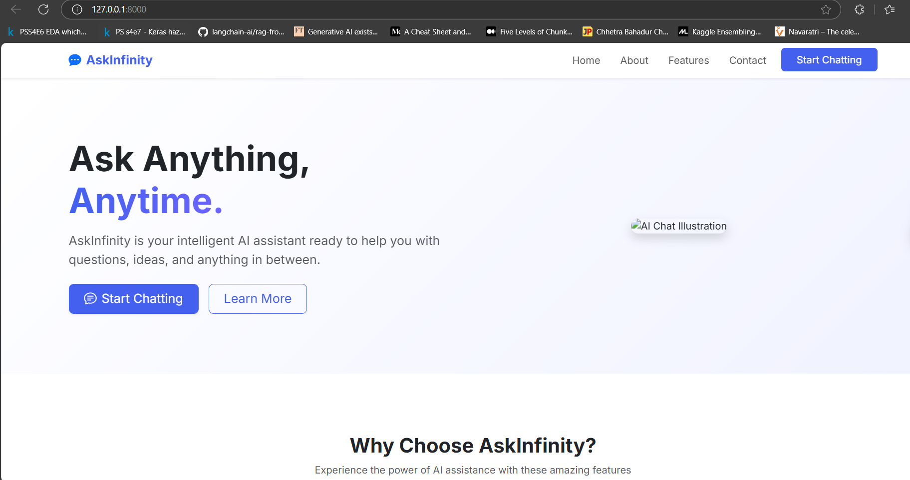
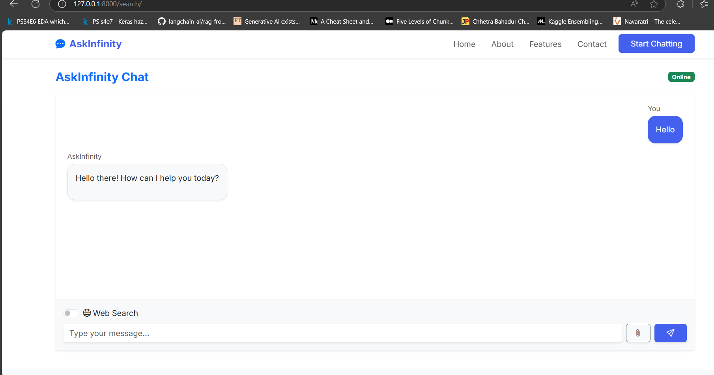

# 🌌 AskInfinity

**AskInfinity** is an AI-powered chatbot web app built with **Django** that allows users to interact with Google's **Gemini** models. It features Markdown-rendered responses, a responsive Bootstrap UI, and real-time web search capabilities via the Tavily API.

---

## 🚀 Features

- 💬 Conversational interface with **Gemini 1.5** (via `langchain-google-genai`)
- 🌐 Real-time web access using **Tavily API**
- 🧠 Rich **Markdown support** for enhanced chat output
- 🎨 Responsive, clean UI built with **Bootstrap 5**
- 🔐 Secure **AJAX communication** with CSRF protection
- 🗃️ Modular design using Django app (`search`)

---

## 🛠️ Tech Stack

- **Backend**: Django 5, LangChain, Gemini (`langchain-google-genai`), Tavily API  
- **Frontend**: HTML, CSS (Bootstrap 5), JavaScript (Fetch API), `marked.js`  
- **AI Models**: Gemini 1.5 Flash  
- **Web Search**: Tavily API  

---

## ⚙️ Setup Instructions

### 1. Clone the repository

```bash
git clone https://github.com/yourusername/askinfinity.git
cd AskInfinity
```

### 2. Run the development server
```
python manage.py runserver
```

hen visit http://127.0.0.1:8000 in your browser to start chatting with AskInfinity.

## ✨ Screenshots
### 🔹 Home Page


### 🔹 Chat Interface

